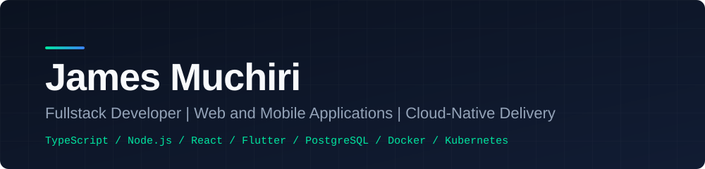

 

---

## Profile

Fullstack engineer focused on building performant, maintainable web and mobile applications and the infrastructure that runs them. I care about clear architecture, readable code, and systems that stay easy to change as they grow.

Currently deepening my work in DevOps and cloud-native technologies, with a focus on containerized delivery and repeatable deployments.

---

## Focus Areas

| Area | What I do |
| :--- | :--- |
| **Application Architecture** | Design modular, scalable backends and frontends with clear boundaries and sensible defaults |
| **Fullstack Delivery** | Take features from data model and API design through to polished, accessible interfaces |
| **Mobile Development** | Build cross-platform Android and iOS applications with Flutter and Dart, backed by well-designed APIs |
| **Cloud and DevOps** | Containerize services, automate builds and deployments, and run workloads on managed cloud platforms |
| **Developer Experience** | Write clean, documented, testable code that other engineers can pick up quickly |

---

## Technical Stack

| Layer | Technologies |
| :--- | :--- |
| **Languages** | TypeScript, JavaScript, Dart, PHP, SQL, HTML, CSS |
| **Frontend** | React, Next.js, Tailwind CSS, Bootstrap |
| **Mobile** | Flutter, Dart |
| **Backend** | Node.js, Express, Laravel |
| **Data** | PostgreSQL, MySQL, MongoDB, SQLite |
| **Infrastructure** | Docker, Kubernetes, AWS, Heroku, Apache |
| **Tooling** | Git, GitHub, Postman, npm, Electron, VS Code |

---

## Engineering Principles

- **Simplicity over cleverness.** The best solution is usually the one that is easiest to understand and maintain.
- **Design for change.** Clear interfaces and small, focused modules make systems easier to evolve.
- **Own the full lifecycle.** Building a feature includes testing it, shipping it, and operating it.
- **Document decisions.** Good READMEs, commit messages, and architecture notes save the whole team time.

---

## Selected Work

<!--
Replace each row with a real project. Keep descriptions to one line:
the problem, what you built, and the result.
-->

| Project | Description | Stack |
| :--- | :--- | :--- |
| [Project Name](https://github.com/DataGeek404/repo-name) | One-line summary of the problem solved and the outcome | Next.js, Node.js, PostgreSQL |
| [Project Name](https://github.com/DataGeek404/repo-name) | One-line summary of the problem solved and the outcome | React, Express, MongoDB |
| [Project Name](https://github.com/DataGeek404/repo-name) | One-line summary of the problem solved and the outcome | Laravel, MySQL, Docker |
| [Mobile App Name](https://github.com/DataGeek404/repo-name) | One-line summary of the problem solved and the outcome | Flutter, Dart, REST API |

---

## Current Goals

- Launch a full SaaS product
- Earn certifications in Docker and Kubernetes
- Contribute regularly to open source
- Mentor junior developers, locally and online

---

## Get in Touch

Open to conversations about software architecture, web and mobile development, open-source collaboration, and engineering roles.

- Email: [techspaceerror404@gmail.com](mailto:techspaceerror404@gmail.com)
- LinkedIn: [muchiri-james](https://www.linkedin.com/in/muchiri-james-12b090317/)
